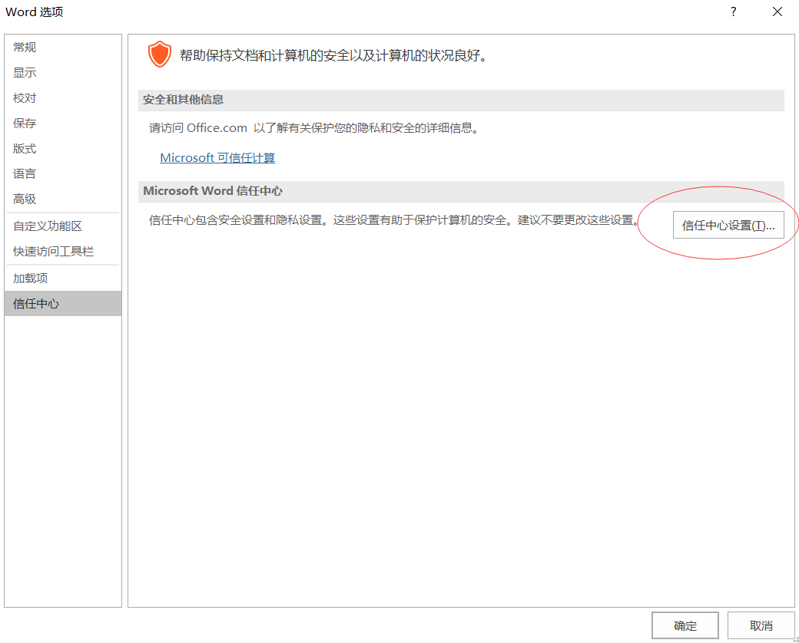
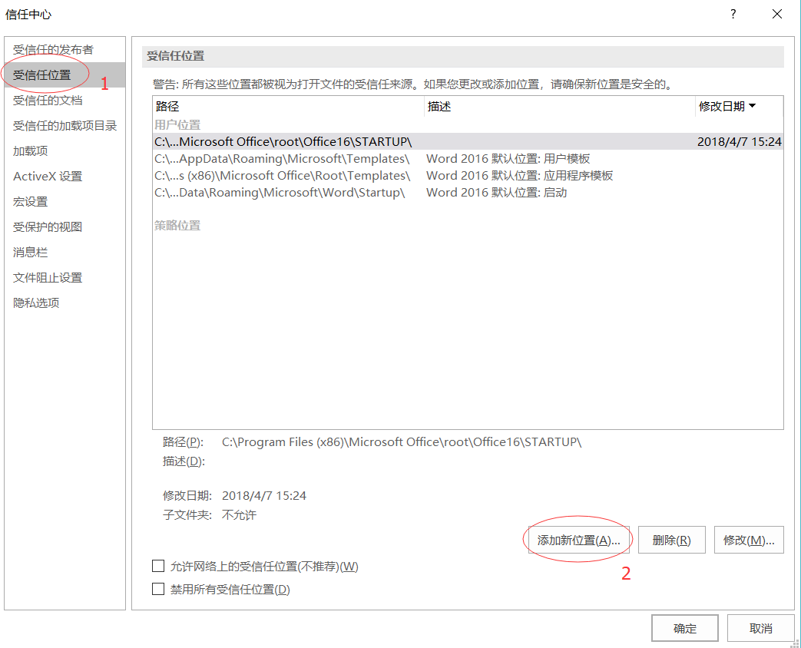
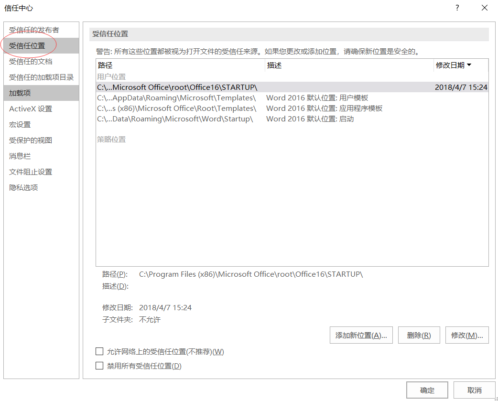

​	由于写论文需要在文章中引入较多的公式，Word自带的公式编辑器又不是很好用，因此就装了MathType公式编辑器，然而在安装完之后打开Word就会出现报错的情况，下面就介绍如何解决此错误。

**第一步**

​	首先找到Word2016安装位置，我的是在C:\Program Files (x86)\Microsoft Office\root\Office16这个位置，然后新建一个STARTUP文件夹，里面会自动生成一个“MathType Commands 6 For Word 2016.dotm”的文件，删除这个文件。

**第二步**

​	打开word->文件->选项->信任中心

将新建的STARTUP文件夹添加进去即可。

第三步：将MathType安装目录下的MathPage文件夹中的64文件夹下的“MathType.wll”文件复制到刚才的Word2016安装目录下（如果你的电脑是32位的系统，则复制32文件夹下的“Mathtype.wll”文件）。

然后打开Word就不会提示错误了。

参考文章：

[如何解决MathPage.wll或MathType.dll文件找不到问题](http://www.mathtype.cn/wenti/jiejue-mathtype-dll-wenti.html)