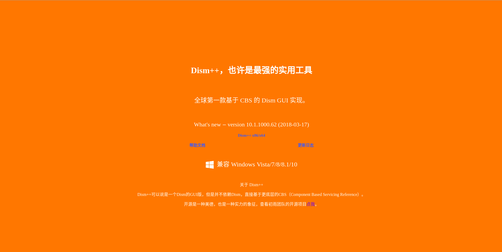

## Windows平台

- 迅雷极速版：无广告，不限速，不过已经从官网下架，如果需要可以从我的百度云下载https://pan.baidu.com/s/1xf5pUrVErmWX_VJyxI6RUQ 密码：d4ox

- [Dism++](https://www.chuyu.me/zh-Hans/index.html)：一款强大的Windows清理工具，而且内置了各种优化工具，如果忍受不了XX全家桶可以试试这个。

  

- [Uninstall tool](https://www.crystalidea.com/uninstall-tool)：一款强大的卸载软件，不过需要付费购买。

  

- [Shadowsocks](https://shadowsocks.org/en/index.html) : 科学上网神器，需要浏览器配合SwitchyOmega插件使用。

## Linux平台

## Linux平台

## Android平台

