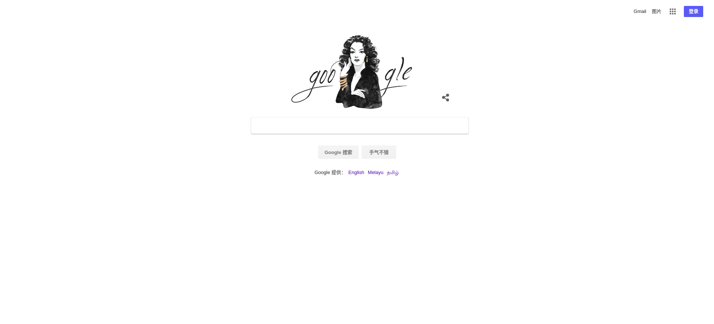

有两种方法：

1.安装Shadowsocks命令行程序，配置命令。

2.安装Shadowsocks GUI图形用户界面，配置。

## 第一种

使用pip安装：

> sudo apt-get update
>
> sudo apt-get install python-pip
>
> sudo apt-get install python-setuptools m2crypto

接着安装Shadowsocks

> pip install shadowsocks

如果是Ubuntu 16.04以后的版本（16.04里可以直接用apt而不用apt-get这一项改进）

> sudo apt install shadowsocks

当然如果安装的时候提示有一些依赖也需要安装，依照提示安装就好了。

### 启动Shadowsocks

安装好之后，在本地我们要用到sslocal，终端输入：

>sslocal --help

可以查看帮助，通过帮助的提示，我们可以知道各个参数是怎样配置的，或者像下面这样直接命令参数写上运行;

> sslocal -s 11.22.33.44 -p 50003 -k "123456" -l 1080 -t 600 -m aes-256-cfb

-s表示IP，-p指的是服务端的端口，-l是本地端口默认1080,-k是密码（要加""），-t是超时，默认300,-m是加密方法，默认aes-256-cfb。（此方法关掉终端后便会失效）

为了方便，推荐使用cclocal -c配置文件路径，这种方式简单好用。

在我们的电脑上新建一个shadowsocks.json的文件(xx/xx是我们的文件路径)，具体内容如下：

> {
>
> ​	"server":"11.22.33.44",            //服务器IP
>
> ​	"server_port":50003,               //服务端端口
>
> ​	"local_port":1080,                    //本地端口，默认1080
>
> ​	"password":"123456",             //ss服务端设置的密码
>
> ​	"timeout":600,                          //超时设置
>
> ​	"method":aes-256-cfb             //加密方法
>
> }

确定上面配置文件没有问题之后，然后在终端输入：

> sslocal -c /xx/xx/shadowsocks.json

回车运行。

连接好了之后去系统的代理设置里面按照说明设置代理，但一般都是全局的，所以我们最好配置我们的浏览器让他可以自动切换，该用代理的时候用代理，直接连接的时候自动直接连接。

## 第二种

安装GUI图形用户界面程序，然后按照提示配置相应的参数。

在Ubuntu上可以通过PPA源安装，仅支持Ubuntu14.04以上版本。

> sudo add-apt-repository ppa:hzwhuang/ss-qt5
>
> sudo apt-get update
>
> sudo apt-get install shadowsocks-qt5

由于是图形界面，配置和windows基本没什么差别，这里就不赘述了。经过上面的配置，你只是启动了sslocal，但是要上网你还需要配置一下浏览器到指定的代理端口，比如1080才可以正式上网。

### 配置浏览器

假如你上面任选一种方式已经开始运行sslocal了，火狐那个老是订阅不了gfwlist所以配置自动模式不好使。所以这里使用的是chrome，你可以在Ubuntu软件中心下载得到。

### 安装插件

我们需要给chrome安装SwitchyOmega插件，但是没有代理之前是不能从谷歌商店下载这个插件的，但是我们可以从Github上下载最新版[https://github.com/FelisCatus/SwitchyOmega/rel](https://github.com/FelisCatus/SwitchyOmega/rel) 然后浏览器地址打开chrome://extensions/，将下载的插件托进去安装。

### 设置代理地址

安装好插件会自动跳到设置选项，有提示你可以跳过，左边新建情景模式-选择代理服务器-比如命名为ss，其他，默认之后创建，之后在代理协议选择SOCKS5，地址为127.0.0.1，端口默认1080。然后保存应用选项。

### 设置自动切换

接着点击自动切换（Auto switch）上面的不用管，在按照规则列表匹配请求后面选择刚才创建的ss，默认情景模式选择直接连接，点击应用保存；在往下规则列表设置选择AutoProxy，然后将[这个地址](https://raw.githubusercontent.com/gfwlist/gfwlist/master/gfwlist.txt) （是地址不是地址里面的内容）添加到里面，点击浏览器右上角的SwitchOmega图标，下面选择自动切换，然后打开google.com试试，其他的就不再赘述了。

###### 注：像一些V-P-N服务商提供的都是线路名称（比如xx.xx.xx这样）没有直接给出IP地址，拿他们提供的线路去ping一下就可以得出IP地址了。

